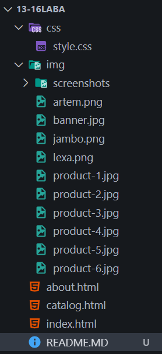
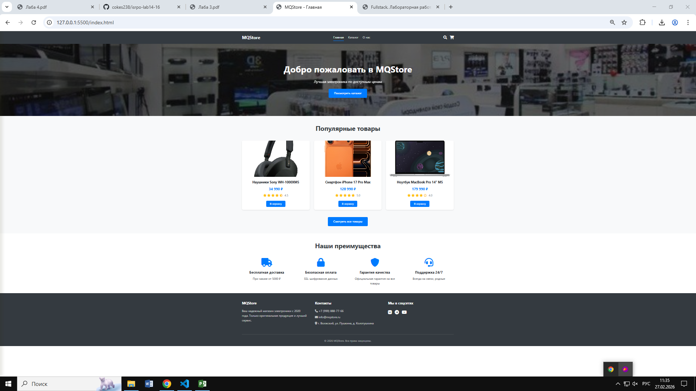
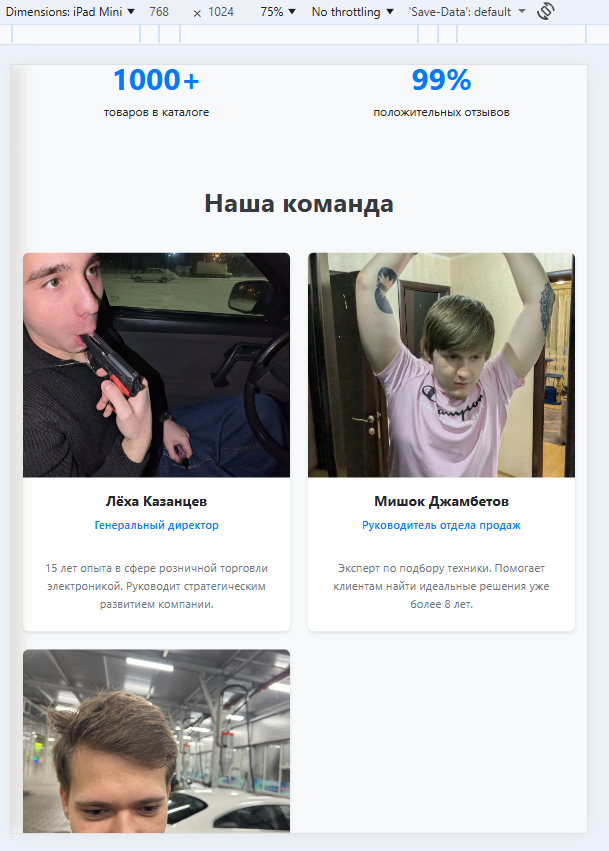
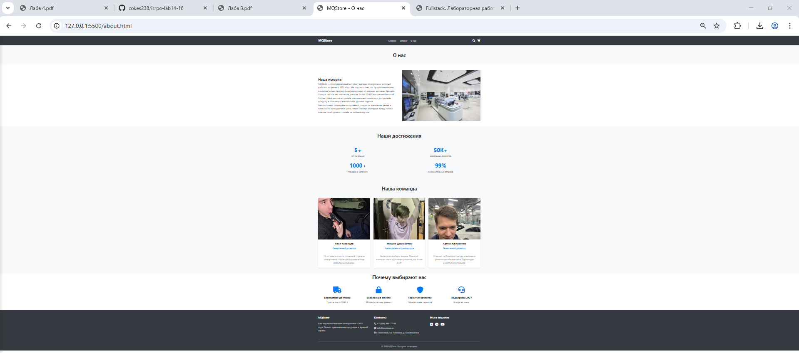

# Лабораторная работа №14-16 - Интернет-магазин "MQStore"

**ФИО:** Горишний Дмитрий Олегович | Яшин Андрей Александрович  
**Группа:** ИСП-232 
**Дата:** 27.02.2026

---

## Описание проекта

Многострайчный сайт интернет-магазина электроники "TechStore" с адаптивной вёрсткой. Проект создан с использованием современных технологий HTML5 и CSS3 (Flexbox, Grid, Media Queries). Сайт состоит из трех страниц: главной, каталога товаров и страницы "О нас".

---

## Реализованные страницы

### 🏠 Главная
- Приветственный баннер (Hero section) с призывом к действию
- Секция "Популярные товары" с тремя карточками
- Секция "Наши преимущества" с четырьмя преимуществами компании
- Полностью адаптивный дизайн

### 📦 Каталог
- Сетка из 9 карточек товаров с использованием CSS Grid (3 колонки на desktop)
- Каждая карточка содержит: изображение, название, цену, рейтинг и кнопку "В корзину"
- Hover-эффекты на карточках (поднятие, тень, масштабирование изображения)
- Единый стиль с главной страницей

### 👥 О нас
- Секция "Наша история" с описанием компании и изображением
- Секция "Наши достижения" со статистикой (4 блока с числами)
- Секция "Наша команда" с тремя карточками сотрудников
- Секция "Почему выбирают нас" (преимущества)
- Полностью адаптивный дизайн

---

## Реализованные функции

| Функция | Описание |
|---------|----------|
| **Адаптивное навигационное меню** | Бургер-меню на мобильных устройствах, плавная анимация |
| **Карточки товаров с hover-эффектами** | Поднятие карточки, появление тени, масштабирование изображения |
| **CSS Grid для каталога** | Автоматическая адаптация колонок (3 → 2 → 1) |
| **Flexbox для навигации и футера** | Гибкое выравнивание элементов в шапке и подвале |
| **Адаптивная вёрстка** | Desktop (1200px+), Tablet (768px-1199px), Mobile (до 767px) |
| **Единая цветовая схема** | Использование CSS-переменных для основных цветов |
| **Семантическая HTML5-разметка** | Теги `<header>`, `<nav>`, `<main>`, `<section>`, `<footer>` |
| **Интерактивные элементы** | Кнопки с изменением цвета при наведении, активные пункты меню |
| **Кастомные иконки** | Использование Font Awesome для иконок соцсетей и преимуществ |

---

## Технологии

- **HTML5** — семантическая разметка страниц
- **CSS3**:
  - Flexbox — для навигации, футера, карточек команды
  - CSS Grid — для каталога товаров и секции преимуществ
  - Media Queries — для адаптации под все устройства
  - CSS Variables — для единой цветовой схемы
  - Transitions — для плавных hover-эффектов
- **Git/GitHub** — контроль версий и удаленный репозиторий
- **Font Awesome** — иконки для интерфейса

---

## Структура проекта

---

## Скриншоты

### 🖥️ Главная страница (Desktop)

### 📱 Каталог товаров (Tablet)

### 👥 Страница "О нас" (Mobile)

---

## Как запустить проект

### Способ 1: Простое открытие
1. Скачайте или клонируйте репозиторий
2. Откройте файл `index.html` в любом современном браузере

### Способ 2: С использованием Live Server (рекомендуется)
1. Установите расширение **Live Server** в VS Code
2. Откройте проект в VS Code
3. Нажмите правой кнопкой мыши на `index.html`
4. Выберите **"Open with Live Server"**
5. Страница автоматически откроется в браузере и будет обновляться при изменениях

---

## Результаты обучения

В ходе выполнения лабораторной работы я:
- Закрепил навыки семантической HTML5-верстки
- Научился создавать сложные адаптивные макеты с использованием Flexbox и CSS Grid
- Освоил работу с медиа-запросами для поддержки различных устройств
- Научился создавать единую систему стилей с использованием CSS-переменных
- Реализовал интерактивные элементы с hover-эффектами
- Создал многостраничный сайт с единым дизайном
- Научился структурировать проект и работать с Git/GitHub

---

© 2026 Горишний, Яшин | Лабораторная работа по веб-разработке